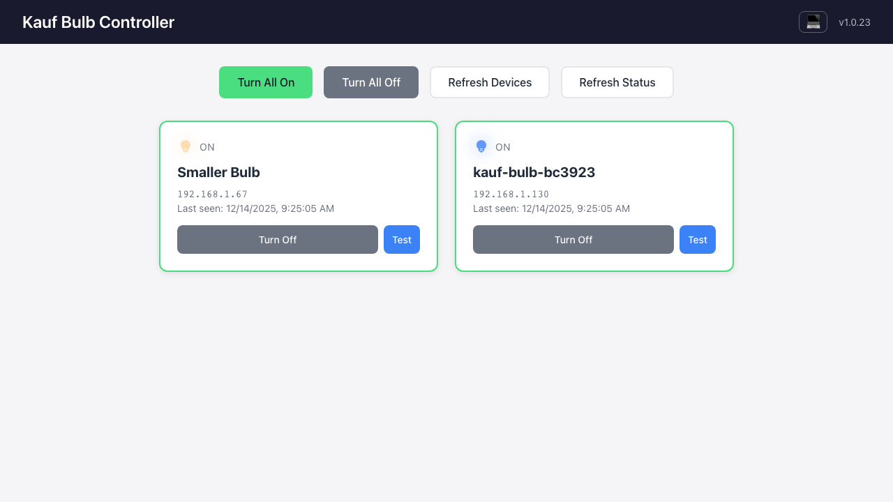

# Kauf Bulb Controller

A local Node.js server and Vue.js web application for discovering and controlling [Kauf RGBWW Smart Bulbs](https://kaufha.com/) on your home network.

 




**[Watch Demo Video](demo.webm)** - See the app in action

## About Kauf Bulbs

[Kauf Bulbs](https://kaufha.com/) are ESP-based smart bulbs running [ESPHome](https://esphome.io/) firmware. They offer local control without cloud dependencies, making them ideal for privacy-conscious smart home setups.

- **Kauf Homepage**: https://kaufha.com/
- **GitHub Repository**: https://github.com/KaufHA/kauf-rgbww-bulbs

## Security Notice

**This application is designed for local home network use only.**

- No authentication or authorization is implemented
- No HTTPS/TLS encryption
- Do not expose this server to the internet
- Do not port-forward or host externally
- Keep the server running only within your trusted home network

## Features

### Server
- **Auto-Discovery**: Automatically discovers Kauf Bulbs on your network using mDNS/Bonjour
- **Persistent Storage**: Remembers bulb names and metadata in `bulb-directory.json`
- **REST API**: Full control of bulbs via HTTP endpoints
- **Real-time Status**: Fetches current state (on/off, brightness, color) from bulbs
- **Bulk Operations**: Turn all bulbs on/off with a single command

### Web Application
- **Responsive UI**: Works on desktop and mobile devices
- **Theme Toggle**: Switch between light, dark, and system themes (persisted in localStorage)
- **Bulb Dashboard**: Visual cards showing each bulb's status with lightbulb icons in actual bulb color
- **Individual Control**: Toggle power, adjust brightness, set colors per bulb
- **Bulk Actions**: Turn all on, turn all off, refresh discovery
- **Settings Modal**: Edit bulb names, view device info (firmware, IP, MAC), close with ESC key
- **Test Mode**: Cycle through red, green, blue to identify bulbs
- **Auto-Refresh**: Periodically updates bulb status
- **Version Link**: Clickable version number linking to GitHub repository

## Installation

### Prerequisites

- Node.js >= 20.19.0
- npm
- Kauf Bulbs on the same network

### Platform Requirements

The application runs on **macOS**, **Linux**, and **Windows**, but mDNS discovery requires platform-specific dependencies:

| Platform | mDNS Requirement |
|----------|------------------|
| **macOS** | Built-in (no action needed) |
| **Linux** | Install Avahi: `sudo apt install avahi-daemon` (Debian/Ubuntu) or equivalent |
| **Windows** | Install [Bonjour Print Services](https://support.apple.com/kb/DL999) or iTunes |

**Note:** Some test scripts (`npm run test:curl`, `npm run test`) require bash and will not run on Windows without WSL, Git Bash, or similar. The core application works without these tests.

### Setup

```bash
# Clone the repository
git clone https://github.com/klaushofrichter/kauf-bulb.git
cd kauf-bulb

# Install dependencies
npm install

# Start the development server
npm run dev
```

The application will be available at http://localhost:3001

## Usage

### Web Interface

1. Open http://localhost:3001 in your browser
2. The app will automatically discover bulbs on your network
3. Use the control buttons:
   - **Turn All On** - Turns on all discovered bulbs
   - **Turn All Off** - Turns off all discovered bulbs
   - **Refresh Devices** - Re-runs mDNS discovery
   - **Refresh Status** - Updates bulb states
4. Click on a bulb card to open the settings modal:
   - Edit the friendly name
   - Adjust brightness (0-100%)
   - Pick a color using the color picker or RGB inputs
   - Set transition time
   - View device information (IP, MAC, firmware version)

### API Endpoints

All endpoints are prefixed with `/api`.

#### List Bulbs
```
GET /api/list
```
Returns all known bulbs with their current state.

Response:
```json
{
  "bulbs": [
    {
      "id": "kauf-bulb-abc123",
      "name": "Living Room",
      "lastSeen": "2025-12-14T10:30:00.000Z",
      "lastIp": "192.168.1.100",
      "online": true,
      "on": true,
      "brightness": 80,
      "r": 255,
      "g": 200,
      "b": 150
    }
  ]
}
```

#### Turn On
```
GET /api/on                     # Turn on all bulbs
GET /api/on?device=<id>         # Turn on specific bulb
GET /api/on?transition=2000     # With 2-second transition
```

Response (all bulbs):
```json
{
  "results": [
    { "device": "kauf-bulb-abc123", "success": true, "ip": "192.168.1.100" },
    { "device": "kauf-bulb-def456", "success": true, "ip": "192.168.1.101" }
  ]
}
```

Response (specific bulb):
```json
{ "device": "kauf-bulb-abc123", "success": true, "ip": "192.168.1.100" }
```

#### Turn Off
```
GET /api/off                    # Turn off all bulbs
GET /api/off?device=<id>        # Turn off specific bulb
```

Response format is the same as Turn On.

#### Refresh Discovery
```
GET /api/refresh
POST /api/refresh
```
Triggers mDNS discovery and waits for devices to respond. This is a **blocking call** that takes ~5 seconds (15-second max timeout). Returns the updated bulb list directly, eliminating the need for a separate `/api/list` call. Discovery also runs automatically every 60 seconds in the background.

Response:
```json
{
  "message": "Discovery completed",
  "bulbs": [...],
  "devicesFound": 2,
  "duration": 5003
}
```

#### Get Bulb State
```
GET /api/bulb/:id/state
```
Returns the current state of a specific bulb.

Response:
```json
{
  "device": "kauf-bulb-abc123",
  "bulb": {
    "id": "kauf-bulb-abc123",
    "name": "Living Room",
    "lastSeen": "2025-12-14T10:30:00.000Z",
    "lastIp": "192.168.1.100",
    "online": true
  },
  "success": true,
  "ip": "192.168.1.100",
  "state": {
    "on": true,
    "brightness": 80,
    "r": 255,
    "g": 200,
    "b": 150
  }
}
```

#### Get Device Info
```
GET /api/bulb/:id/info
```
Returns firmware version, ESPHome version, and MAC address.

Response:
```json
{
  "device": "kauf-bulb-abc123",
  "success": true,
  "ip": "192.168.1.100",
  "info": {
    "title": "Kauf Bulb abc123",
    "esphomeVersion": "2025.8.1",
    "projectName": "Kauf.RGBWW",
    "firmwareVersion": "1.96(u)",
    "macAddress": "C4:5B:BE:AB:C1:23",
    "freeSpace": 512000
  }
}
```

#### Test Bulb
```
POST /api/bulb/:id/test
```
Cycles the bulb through red, green, blue colors for identification.

Response:
```json
{ "device": "kauf-bulb-abc123", "success": true, "ip": "192.168.1.100" }
```

#### Advanced Control
```
POST /api/bulb/:id/control
Content-Type: application/json

{
  "state": "on",
  "brightness": 75,
  "r": 255,
  "g": 128,
  "b": 0,
  "transition": 1000
}
```

Response:
```json
{ "device": "kauf-bulb-abc123", "success": true, "ip": "192.168.1.100" }
```

#### Update Bulb Name
```
POST /api/bulb/:id/name
Content-Type: application/json

{
  "name": "Living Room Lamp"
}
```

Response:
```json
{ "device": "kauf-bulb-abc123", "name": "Living Room Lamp" }
```

### API Examples with curl

A test script with all curl commands is available at `tests/curl/test-api.sh`. Run with `npm run test:curl`.

```bash
# List all bulbs
curl http://localhost:3001/api/list

# Turn on all bulbs
curl http://localhost:3001/api/on

# Turn off all bulbs
curl http://localhost:3001/api/off

# Turn on a specific bulb
curl "http://localhost:3001/api/on?device=kauf-bulb-abc123"

# Turn off a specific bulb
curl "http://localhost:3001/api/off?device=kauf-bulb-abc123"

# Turn on with custom transition (2 seconds)
curl "http://localhost:3001/api/on?device=kauf-bulb-abc123&transition=2000"

# Refresh device discovery
curl http://localhost:3001/api/refresh

# Get bulb state
curl http://localhost:3001/api/bulb/kauf-bulb-abc123/state

# Get device info (firmware, MAC address)
curl http://localhost:3001/api/bulb/kauf-bulb-abc123/info

# Test bulb (cycles through red, green, blue)
curl -X POST http://localhost:3001/api/bulb/kauf-bulb-abc123/test

# Set brightness to 50% with orange color
curl -X POST http://localhost:3001/api/bulb/kauf-bulb-abc123/control \
  -H "Content-Type: application/json" \
  -d '{"state": "on", "brightness": 50, "r": 255, "g": 128, "b": 0}'

# Set color to blue with 1 second transition
curl -X POST http://localhost:3001/api/bulb/kauf-bulb-abc123/control \
  -H "Content-Type: application/json" \
  -d '{"brightness": 100, "r": 0, "g": 0, "b": 255, "transition": 1000}'

# Turn off with slow fade (3 seconds)
curl -X POST http://localhost:3001/api/bulb/kauf-bulb-abc123/control \
  -H "Content-Type: application/json" \
  -d '{"state": "off", "transition": 3000}'

# Update bulb friendly name
curl -X POST http://localhost:3001/api/bulb/kauf-bulb-abc123/name \
  -H "Content-Type: application/json" \
  -d '{"name": "Living Room Lamp"}'
```

## Configuration

### Environment Variables

Create a `.env` file in the project root to customize settings (see `.env.example`):

```
PORT=3001    # Server port (default: 3001)
```

The server will use port 3001 by default. Change the `PORT` value to run on a different port.

### Bulb Directory

Bulb metadata is stored in `bulb-directory.json`:

```json
[
  {
    "id": "kauf-bulb-abc123",
    "name": "Kitchen Light",
    "lastSeen": "2025-12-13T10:30:00Z",
    "lastIp": "192.168.1.100"
  }
]
```

## Development

### Available Scripts

```bash
npm run dev          # Start development server with hot reload
npm run build        # Build for production
npm run start        # Run production server
npm run test         # Run all tests (unit + E2E)
npm run test:watch   # Run tests in watch mode
npm run test:api     # Run API unit tests only
npm run test:e2e     # Run Playwright E2E tests only
npm run test:e2e:ui  # Run E2E tests with UI
```

### Project Structure

```
kauf-bulb/
├── server/
│   ├── index.js           # Express server entry point
│   ├── discovery.js       # mDNS device discovery
│   ├── bulbController.js  # ESPHome API interactions
│   ├── bulbStore.js       # In-memory store + persistence
│   └── routes/
│       └── api.js         # REST API routes
├── src/
│   ├── App.vue            # Main Vue component
│   ├── main.js            # Vue entry point
│   ├── components/
│   │   ├── BulbList.vue   # Bulb grid with controls
│   │   ├── BulbCard.vue   # Individual bulb card
│   │   └── BulbModal.vue  # Settings modal
│   └── composables/
│       ├── useBulbs.js    # API composable
│       └── useTheme.js    # Theme management composable
├── scripts/
│   ├── record-demo.js     # Demo video recording script
│   └── take-screenshot.js # Screenshot capture script
├── tests/
│   ├── api/               # API unit/integration tests
│   ├── curl/              # Curl API test script
│   └── e2e/               # Playwright E2E tests
├── package.json
├── vite.config.js
└── playwright.config.js
```

### Testing

The project includes comprehensive tests:

- **API Tests**: Unit tests for all endpoints using Vitest + Supertest
- **Integration Tests**: Tests against real bulbs on the network
- **E2E Tests**: Browser tests using Playwright with video recording
- **Curl Tests**: Shell script testing all API endpoints

```bash
# Run all tests
npm run test

# Run with real bulb integration
npm run test:api:integration

# Run curl API tests only
npm run test:curl
```

### Demo Recording

A Playwright-based script is available to record demo videos of the application:

```bash
# Record a new demo video (requires server running and bulbs on network)
node scripts/record-demo.js
```

The script:
- Sets up initial bulb state (first bulb ON white 70%, second OFF)
- Sets light theme for consistent appearance
- Shows a visible cursor with click animations
- Demonstrates: Turn All On/Off, individual bulb controls, modal with brightness and RGB color adjustment
- Outputs `demo.webm` in the project root

## Technical Details

### ESPHome API

Kauf Bulbs expose a REST API via ESPHome:

- `POST /light/light/turn_on?brightness=255&r=255&g=0&b=0&transition=1`
- `POST /light/light/turn_off?transition=1`
- `GET /light/light` - Returns current state

### mDNS Discovery

The server discovers bulbs by browsing for `_esphomelib._tcp` services and filtering for names starting with `kauf-bulb`.

## License

MIT

## Acknowledgments

- [Kauf Smart Home](https://kaufha.com/) for creating excellent ESPHome-based bulbs
- [ESPHome](https://esphome.io/) for the local control firmware
- [Bonjour Service](https://github.com/onlxltd/bonjour-service) for mDNS discovery
